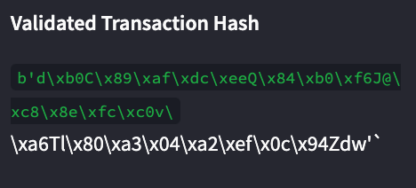
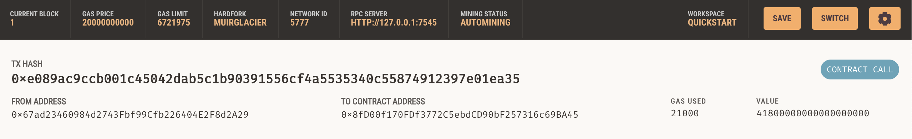
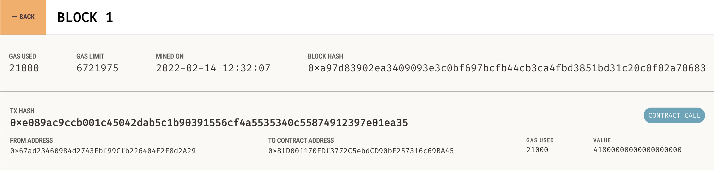
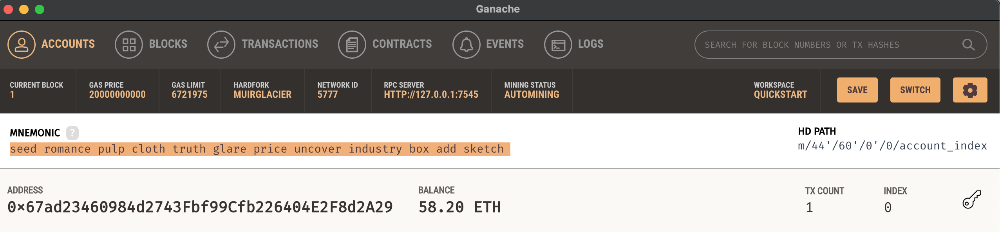

# Fintech Finder

## What is Fintech Finder?
Fintech Finder is an application that its customers can use to find fintech professionals from among a list of candidates, hire them, and pay them.  It integrates the Ethereum blockchain network into the application in order to enable customers to instantly pay the fintech professionals whom they hire with cryptocurrency.
 
 

## How do I know my transaction has gone through?
By paying via the Ethereum blockchain, there are multiple ways to see that your transaction had been processed.
 
 

1) In the lower left hand corner of the Fintech Finder website, you will be able to see a Verified Transaction Hash which validates that the transaction has been processed.  

    

2) You can also navigate to a block exploer like etherscan and enter the address your wallet address.  In the example below, we're looking at our address in Ganache and can see the tx hash, from address, and contract address of the transaction.

    

3) You can also view the transaction in the block. 

    

4) When you check your wallet, you will see your balance had decreased by the amount you sent.

    

